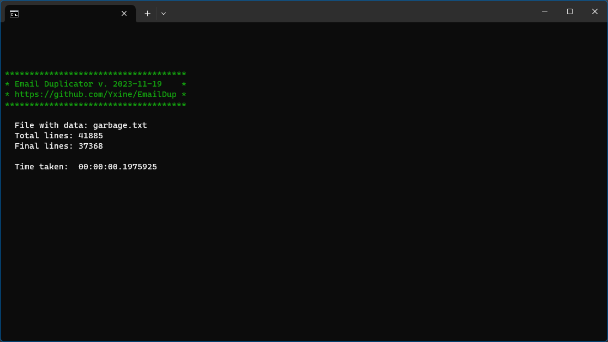

# E-mail Duplicator

> Updated 2024-08-11

## About

E-mail duplicator takes input file with data and produces output file which contains list of unique e-mails from first one.


## Sample of usage

Let's take simple service <https://helpseotools.com/web-tools/fake-email-and-password> and generate some fake e-mails with passwords and we will add some garbage in each line:

```text
1,a;user40535@aol.com;a56jgx8f; 	 ;Support@Gmail.COM|2023
2,b;user53746@yahoo.com;787d3qv7; 	 ;support@gmail.com|2023
3,c;user93416@gmail.com;1mwz9ihi; 	 ;support@gmail.com|2023
4,d;user93779@aol.com;zt6x9vul; 	 ;support@gmail.com|2023
5,e;user85884@aol.com;g20iund9; 	 ;support@gmail.com|2023
6,f;user53028@yahoo.com;qkyxqmpj; 	 ;support@gmail.com|2023
7,g;user73653@yahoo.com;b0hqofgi; 	 ;support@gmail.com|2023
8,h;user24352@outlook.com;5j9g9h6s; 	 ;support@gmail.com|2023
9,i;user65708@outlook.com;icwd4h0x; 	 ;support@gmail.com|2023
10,j;user30207@aol.com;drlio7r7; 	 ;support@gmail.com|2023
```

Now we start our cleaner:

```bash
EmailDup.exe sample.txt
```

And here is the clean output:

```text
user40535@aol.com
support@gmail.com
user53746@yahoo.com
user93416@gmail.com
user93779@aol.com
user85884@aol.com
user53028@yahoo.com
user73653@yahoo.com
user24352@outlook.com
user65708@outlook.com
user30207@aol.com
```

## Optimizations

### List vs HashSet




## History

### 2024.08.11

- .NET 8.0 and Go release
